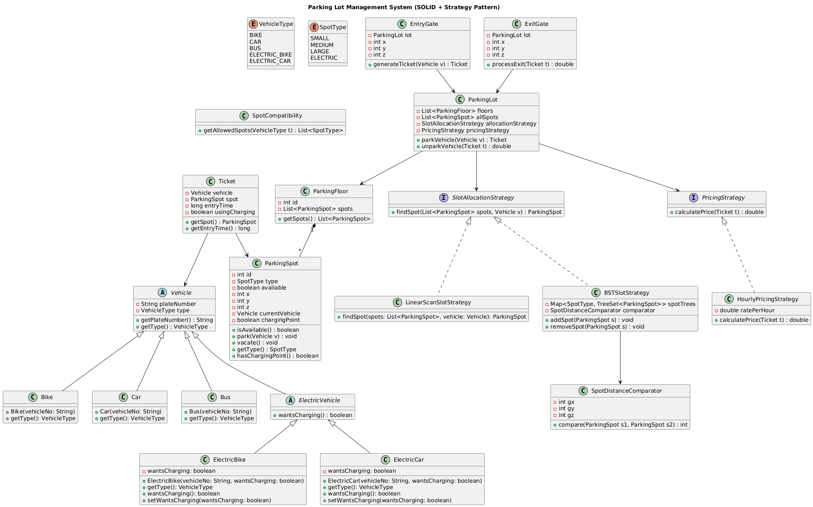

# 🚗 Parking Lot Management System

A comprehensive Java-based parking lot management system implementing low-level design (LLD) principles with multiple design patterns and optimization strategies.

## 📋 Table of Contents
- [Overview](#overview)
- [classDiagram](#classDiagram)
- [Features](#features)
- [System Architecture](#system-architecture)
- [Design Patterns Used](#design-patterns-used)
- [Class Structure](#class-structure)
- [Setup and Installation](#setup-and-installation)
- [Usage](#usage)
- [Configuration](#configuration)
- [Performance](#performance)
- [Future Enhancements](#future-enhancements)

## 🎯 Overview

This parking lot management system is designed to handle vehicle parking and exit operations efficiently. The system supports multiple vehicle types, different parking spot sizes, electric vehicle charging spots, and implements various optimization strategies for slot allocation.

## Class Diagram


### Key Highlights
- **Multi-floor parking support**
- **Multiple vehicle types** (Cars, Bikes, Buses, Electric vehicles)
- **Dynamic spot allocation** with fallback mechanisms
- **Flexible pricing strategies**
- **Optimized slot finding algorithms** (Linear scan O(N) vs BST O(log N))
- **Electric vehicle charging support**

## ✨ Features

### Vehicle Management
- 🏍️ **Bikes** - Uses small spots
- 🚗 **Cars** - Uses medium spots  
- 🚌 **Buses** - Uses large spots
- ⚡ **Electric Bikes** - Uses electric spots (fallback to small)
- 🔋 **Electric Cars** - Uses electric spots (fallback to medium)

### Spot Management
- 📏 **Multiple spot sizes** (Small, Medium, Large, Electric)
- 🎯 **Smart allocation** with vehicle-spot compatibility
- 📍 **Distance-based optimization** for closest spot allocation
- 🔄 **Fallback mechanism** when preferred spots are unavailable

### Pricing System
- 💰 **Flexible pricing strategies** (Per-hour pricing implemented)
- 📊 **Extensible pricing models**
- 🎫 **Ticket-based billing system**

### Performance Optimization
- 🔍 **Linear Scan Strategy** - Simple O(N) approach
- 🌳 **BST Strategy** - Optimized O(log N) slot finding using Binary Search Tree
- 📐 **Distance-based sorting** for closest spot allocation

## 🏗️ System Architecture

The system follows SOLID principles and implements several design patterns:

```
┌─────────────────┐    ┌─────────────────┐
│   EntryGate     │    │    ExitGate     │
│                 │    │                 │
│ + generateTicket│    │ + processExit   │
└─────────┬───────┘    └─────────┬───────┘
          │                      │
          └──────┐        ┌──────┘
                 │        │
         ┌───────▼────────▼───────┐
         │     ParkingLot         │
         │                        │
         │ - floors               │
         │ - allocationStrategy   │
         │ - pricingStrategy      │
         └────────┬───────────────┘
                  │
          ┌───────▼───────┐
          │ ParkingFloor  │
          │               │
          │ - spots       │
          └───────┬───────┘
                  │
          ┌───────▼───────┐
          │ ParkingSpot   │
          │               │
          │ - spotType    │
          │ - vehicle     │
          └───────────────┘
```

## 🎨 Design Patterns Used

1. **Builder Pattern** - `ParkingLot.Builder` for complex object construction
2. **Strategy Pattern** - `SlotAllocationStrategy` and `PricingStrategy` interfaces
3. **Factory Pattern** - Vehicle type creation and spot compatibility
4. **Observer Pattern** - Spot availability tracking
5. **Template Method** - Vehicle hierarchy with abstract methods

## 📁 Class Structure

### Core Classes
- **`ParkingLot`** - Main parking lot management
- **`ParkingFloor`** - Represents a single floor
- **`ParkingSpot`** - Individual parking spot
- **`Ticket`** - Parking ticket with timing information

### Vehicle Hierarchy
```
Vehicle (Abstract)
├── Bike
├── Car  
├── Bus
├── ElectricVehicle (Abstract)
    ├── ElectricBike
    └── ElectricCar
```

### Strategies
- **`SlotAllocationStrategy`** (Interface)
  - `LinearScanSlotStrategy` - O(N) simple scan
  - `BSTSlotStrategy` - O(log N) optimized search
- **`PricingStrategy`** (Interface)
  - `PerHourPricingStrategy` - Time-based pricing

### Gates and Processing
- **`EntryGate`** - Vehicle entry and ticket generation
- **`ExitGate`** - Vehicle exit and payment processing

## 🚀 Setup and Installation

### Prerequisites
- Java 8 or higher
- Java IDE (optional, for development)

### Installation Steps

1. **Clone or download the project**
   ```bash
   git clone <repository-url>
   cd parkingLot
   ```

2. **Compile the project**
   ```bash
   javac *.java
   ```

3. **Run the application**
   ```bash
   java Main
   ```

## 💻 Usage

### Basic Usage Example

```java
// Create parking spots
List<ParkingSpot> spots = new ArrayList<>();
spots.add(new ParkingSpot(1, SpotType.SMALL, 1, 0, 0, 0));
spots.add(new ParkingSpot(2, SpotType.MEDIUM, 1, 1, 0, 0));

// Create parking floor
ParkingFloor floor = new ParkingFloor(1, spots);

// Build parking lot with strategy
ParkingLot lot = new ParkingLot.Builder()
    .floors(Arrays.asList(floor))
    .allocationStrategy(new LinearScanSlotStrategy())
    .pricingStrategy(new PerHourPricingStrategy(10.0))
    .build();

// Create gates
EntryGate entry = new EntryGate(lot, 0, 0, 0);
ExitGate exit = new ExitGate(lot, 0, 0, 0);

// Park vehicle
Vehicle car = new Car("CAR-123");
Ticket ticket = entry.generateTicket(car);

// Process exit
double price = exit.processExit(ticket);
```

### Vehicle Types and Spot Compatibility

| Vehicle Type | Primary Spot | Fallback Spots |
|--------------|--------------|----------------|
| Bike | Small | - |
| Car | Medium | Large |
| Bus | Large | - |
| Electric Bike | Electric | Small |
| Electric Car | Electric | Medium, Large |

## ⚙️ Configuration

### Slot Allocation Strategies

**Linear Scan Strategy** (Default)
- Time Complexity: O(N)
- Space Complexity: O(1)
- Best for: Small parking lots

**BST Strategy** (Optimized)
- Time Complexity: O(log N)
- Space Complexity: O(N)
- Best for: Large parking lots with distance-based optimization

### Pricing Configuration

```java
// Per-hour pricing with custom rate
PricingStrategy pricing = new PerHourPricingStrategy(15.0); // $15 per hour

// Usage in parking lot builder
ParkingLot lot = new ParkingLot.Builder()
    .pricingStrategy(pricing)
    .build();
```

## 📊 Performance

### Algorithm Comparison

| Operation | Linear Scan | BST Strategy |
|-----------|-------------|--------------|
| Find Spot | O(N) | O(log N) |
| Add Spot | O(1) | O(log N) |
| Remove Spot | O(N) | O(log N) |
| Memory | O(1) extra | O(N) extra |

### Recommendations
- **Small lots (< 100 spots)**: Use Linear Scan
- **Large lots (> 100 spots)**: Use BST Strategy
- **Distance matters**: Always use BST with `SpotDistanceComparator`

## 🔧 Extensibility

### Adding New Vehicle Types
1. Extend `Vehicle` class
2. Define new `VehicleType` enum value
3. Update `SpotCompatibility` class
4. Register in vehicle factory

### Adding New Pricing Strategies
1. Implement `PricingStrategy` interface
2. Add custom pricing logic in `calculatePrice()` method

### Adding New Allocation Strategies
1. Implement `SlotAllocationStrategy` interface
2. Implement `findSpot()` method with custom logic

## 🤝 Contributing

1. Fork the repository
2. Create a feature branch (`git checkout -b feature/amazing-feature`)
3. Commit your changes (`git commit -m 'Add some amazing feature'`)
4. Push to the branch (`git push origin feature/amazing-feature`)
5. Open a Pull Request
